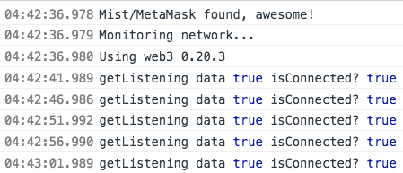
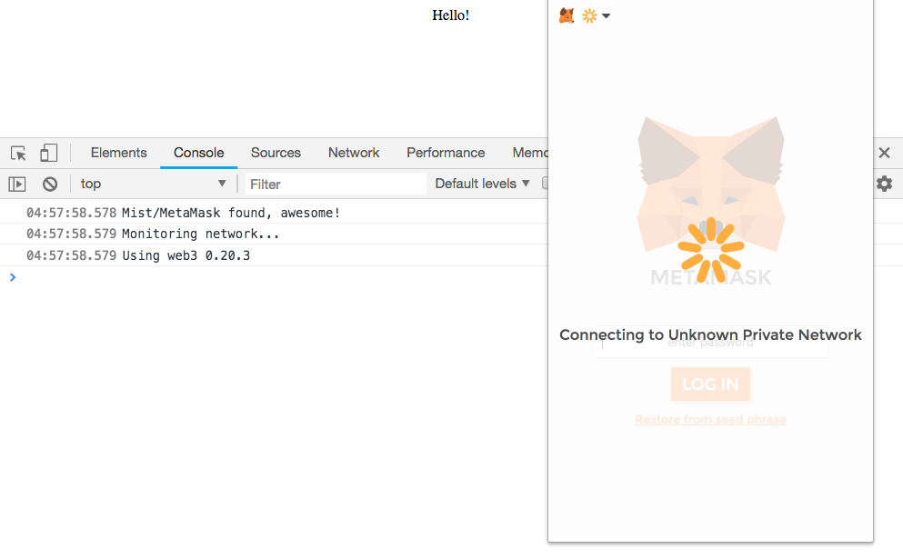

This repo is created to assist MetaMask team to understand the context of reported [issue](https://github.com/MetaMask/metamask-extension/issues/4181) by me easier and clearer.

Note:

I'm using web3 0.20.3 for this simulation.

---

### Results

#### Scenario 1 - Killing The Running Node

##### Steps to reproduce

1. Launch a reachable node (private)
2. Launch Dapp and configure MetaMask to connect to the node in step 1
3. Kill the node
4. Keep using the node in MetaMask

Results:

Both `getListening` and `isConnected` functions return `true` after the node is killed.

---

#### Scenario 2 - Switching to Dead Node

##### Steps to reproduce

1. Launch Dapp
2. In MetaMask, connect to Main Network
3. Then, switch to a private node that is dead (not reachable)

Results:

MetaMask just hung at `Connecting to Unknown Private Network` screen. `getListening` and `isConnected` functions didn't get fired. No errors shown in browser developer console.

---

#### Scenario 3 - Main Network Before Dead Node

##### Steps to reproduce

1. Launch Dapp
2. Connect to a reachable node (private) and configure MetaMask to connect to the node
3. Switch to Main Network
4. Kill the node in step 2
5. Switch back to private node in step 2

Results:

Same as Scenario 2 results.
